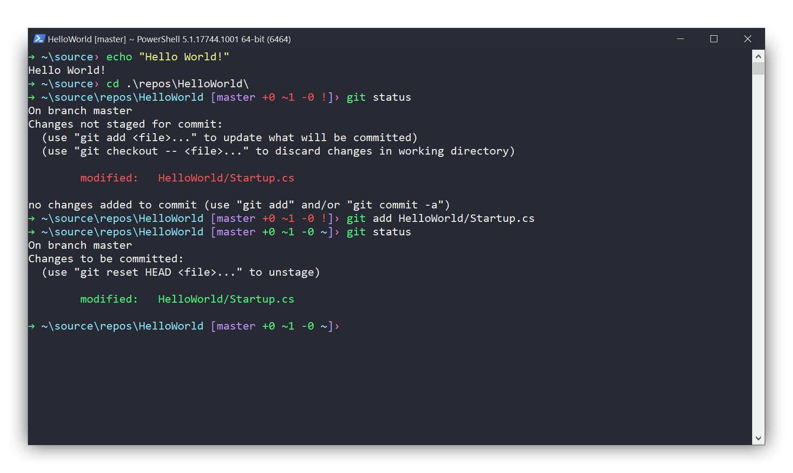

# Dracula for the PowerShell Console

> A dark theme for the Windows 10 Console, supports both [PowerShell](https://github.com/PowerShell/PowerShell) and [cmd.exe](https://en.wikipedia.org/wiki/Cmd.exe).

<i>git integration is available only in powershell via posh-git</i>

## Installation

See our [installation instructions here](https://github.com/dracula/powershell/blob/master/INSTALL.md).

## Support for other terminals

This repo also contains a [theme for the new Windows Terminal from Microsoft](https://github.com/dracula/powershell/blob/master/theme/Windows%2010%20Terminal%20Dracula%20Theme.json), as well as a [theme for ConEmu](https://github.com/dracula/powershell/blob/master/theme/ConEmu-Dracula-Theme.xml). An alternate version of the ConEmu theme is available at [dracula/conemu](https://github.com/dracula/conemu).

## Frequently Asked Questions

<dl>
    <dt><a id="profile-explanation" name="profile-explanation">What's the PowerShell <code>$profile</code> file?</a></dt>
    <dd>This is a PowerShell file that's run when a PowerShell session is started, similar to a <code>.bashrc</code>. Type <code>$profile</code> in a PowerShell window to see the path. See https://ss64.com/ps/syntax-profile.html for more detail.</dd>
    <dt>After applying the theme, other consoles don't always have the right colors.</dt>
    <dd>There are two possible reasons for this:
        <ol>
            <li>Step 3 from the theme installation was not followed; it's a requirement for the way that the windows console properties save settings.</li>
            <li>The shortcut used to apply the theme was different from shortcut used to open the console.
                <ul>
                    <li>The windows console stores its font / color settings in per-shortcut. You can see / delete the special cases in the registry. Go to <code>\HKEY_CURRENT_USER\Console\</code> and delete the subkeys so the default values in the <code>Console</code> key are used.</li>
                </ul>
            </li>
        </ol>
    </dd>
    <dt>What's that crazy cmd.exe prompt string?</dt>
    <dd>The cmd.exe prompt value can be broken down into the following <a href="http://ascii-table.com/ansi-escape-sequences.php">ANSI escape sequences</a>:
        <ul>
            <li><code>E[1;32;40m</code> - normal text with a green foreground and black background</li>
            <li><code>→ </code> - unicode arrow and space</li>
            <li><code>$E[1;36;40m</code> - normal text with a cyan foreground and black background</li>
            <li><code>$p</code> - current drive and path. See <code>prompt /?</code> output for additional values</li>
            <li><code>$E[1;35;40m</code> - normal text with a magenta foreground and black background</li>
            <li><code>› </code> - unicode chevron and space</li>
            <li><code>$E[1;37;40m</code> - normal text with a white foreground and black background</li>
        </ul>
    </dd>
</dl>

## Uninstallation

1. Uninstall the colors:
    - Download and unzip [the same archive](https://raw.githubusercontent.com/waf/dracula-cmd/master/dist/ColorTool.zip) you used to install the theme.
    - Run uninstall.cmd
1. Uninstall the prompts:
    - PowerShell prompt: remove the configuration from your powershell `$profile`.
    - CMD.exe prompt: delete the `prompt` environment variable.

## Team

This theme is maintained by the following person(s) and a bunch of [awesome contributors](https://github.com/dracula/powershell/graphs/contributors).

 | 
--- | ---
[Will Fuqua](https://github.com/waf) | [Zeno Rocha](https://github.com/zenorocha)

#### Contributors

[Tim Kilåker](https://github.com/TKilaker) - Contributed an updated release of ColorTool.exe.

## License

[MIT License](./LICENSE)
